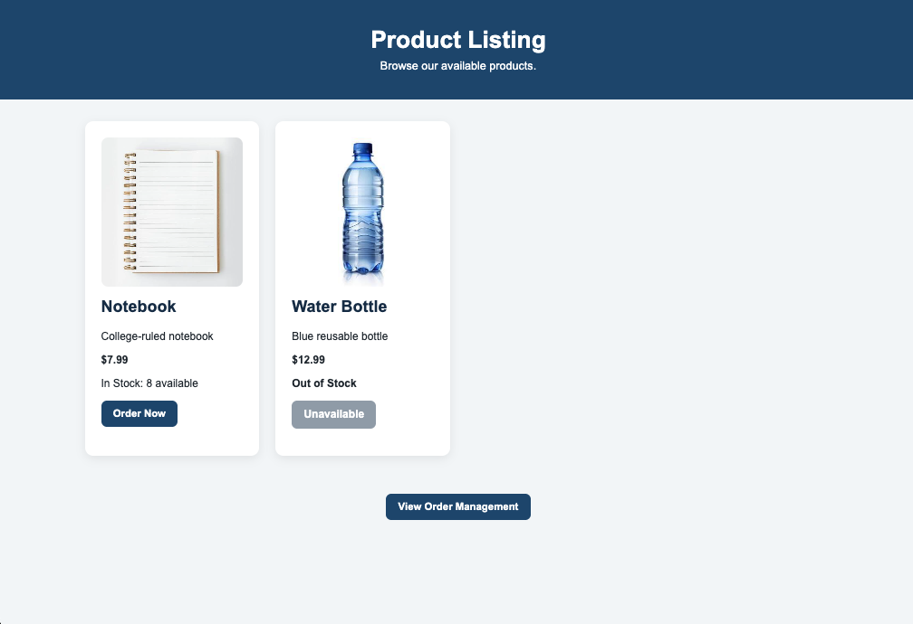
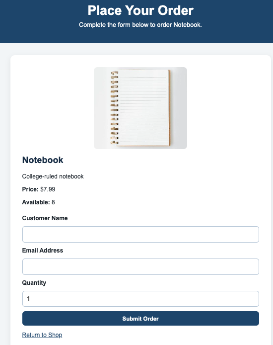
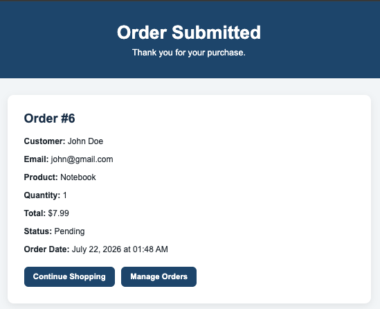
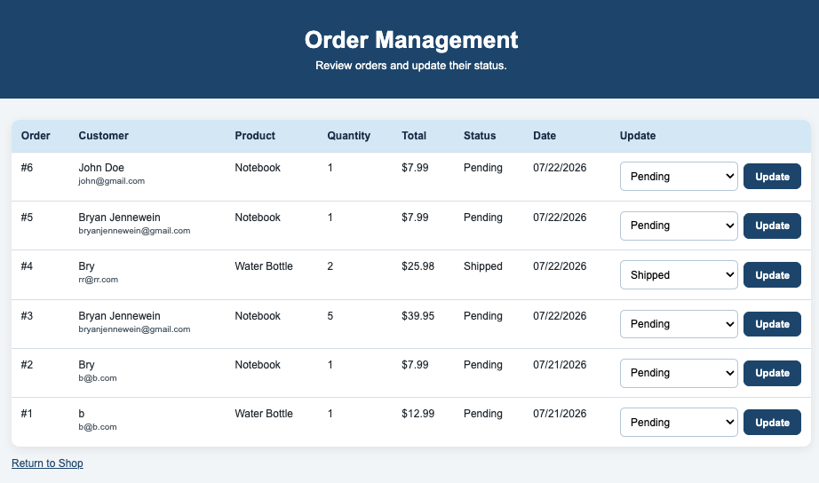

# Bryan's E-Commerce Flask Application

## COMPSCIX446 – Modern Web and App Development
### Module 10 Assignment – Final Project Documentation

---

# Overview

This project is a Flask-based e-commerce web application that was developed incrementally throughout the course. Each module introduced new cloud computing and web development concepts that were incorporated into the application. Over the ten modules of this course, the project now includes product management, order management, user authentication, monitoring, logging, security enhancements, and performance monitoring.

The goal of the project was not only to build a functional web application but also to demonstrate modern software engineering practices used in cloud-hosted applications.

---

# Features

## Product Catalog

- Displays products with images, descriptions, prices, and available inventory.
- Dynamically renders product information using Jinja templates.
- Supports inventory tracking by displaying current stock levels.

**Why I added this is because** this feature demonstrates dynamic database-driven web pages and provides the core shopping experience for the application.

---

## Order Management

Users can:

- Create new orders
- View order confirmations
- Browse all orders
- Update order status
- Automatically reduce inventory when orders are placed

**Why I added this is because** order management demonstrates CRUD operations using SQLAlchemy while showing how application logic interacts with database records.

---

## User Authentication

The application includes user authentication using Flask-Login. Authenticated users can securely access protected functionality while unauthorized users are redirected appropriately.

**Why I added this is because** authentication demonstrates secure user management and role-based access to application functionality.

---

## Monitoring and Logging

Module 9, Project Part 9 was particularly interesting because I introduced application-wide monitoring and structured logging.

Features include:

- Request logging
- HTTP status logging
- Client IP logging
- Response time monitoring
- Rotating application logs
- Order creation logging
- Order status update logging
- Exception logging

Application logs are automatically written to `logs/app.log` using Python's `RotatingFileHandler`.

**Why I added all of this was because** this module and course project part really emphasized the importance of logging for a variety of reasons, including application usability, reliability, and security. The logging provides visibility into application behavior and assists with debugging, troubleshooting, and monitoring application health, too.

---

## Security Enhancements

Several security improvements were also implemented throughout the project and culminated during Module 9.

### Client-side Validation

HTML form validation provides immediate feedback by checking:

- Required fields
- Email format
- Minimum quantity
- Maximum available inventory

### Server-side Validation

Flask independently validates:

- Customer name
- Email address
- Order quantity
- Available inventory

This layered validation protects the application even if browser validation is bypassed.

### HTTP Security Headers

Every response now includes:

- `X-Content-Type-Options`
- `X-Frame-Options`
- `Referrer-Policy`
- `Permissions-Policy`

These headers improve browser security by reducing exposure to clickjacking, MIME sniffing, unnecessary browser permissions, and information leakage.

---

## Performance Monitoring

The application automatically records request duration for every HTTP request.

Performance testing was performed using repeated `curl` requests, verifying that:

- Requests completed successfully
- Response times were recorded
- Monitoring continued to function correctly under repeated traffic

Together, these features create a secure, database-driven e-commerce application that demonstrates many of the concepts covered throughout the course.

---

# Challenges

Developing the application presented several challenges, particularly when configuring the Flask application factory, organizing blueprints, and initializing the database. One issue encountered during Module 9 was configuring application logging, as Flask's default logger initially prevented the rotating file handler from writing to the log file. Resolving this required updating the logging configuration to properly support both console output and persistent log files. During testing, I also observed that browser-based HTML validation prevented some invalid requests from reaching the server, reinforcing the importance of implementing both client-side validation for usability and server-side validation for application security.

During the final testing phase in Module 10, I also reviewed the application from the perspective of an end user, checking navigation, form validation, layout, and browser behavior. While no major defects were discovered, this process reinforced the importance of comprehensive testing before releasing an application.

---

# Configuration

The application was developed using Python and the Flask web framework with SQLAlchemy and SQLite for database management, Jinja2 for server-side HTML templating, and Flask-Login for user authentication. Application monitoring and logging were implemented using Python's built-in logging module with a RotatingFileHandler to manage log files. Development was completed primarily in Visual Studio Code, with Git and GitHub used for version control and branch management throughout the project. The completed application was tested locally, within Codio, and through its deployed DigitalOcean instance using multiple browsers to verify functionality and overall usability.

---

# Testing & Debugging

Before final submission, I performed a comprehensive review of the application to verify that all major functionality worked correctly.

The following features were tested:

- Home page navigation
- Product catalog display
- Product images
- Order creation
- Order confirmation
- Order management
- Inventory updates after purchases
- Client-side form validation
- Server-side validation
- Authentication
- Security headers
- Application logging
- Performance logging

Additional testing included:

- Chrome and Safari browser compatibility
- Responsive layout at multiple browser widths
- Verification that invalid form input displayed appropriate error messages
- Verification that application logs continued recording requests and response times correctly

No critical issues were discovered during the final testing process. Minor documentation updates and project organization were completed before final submission.

---

# Repository

### GitHub Repository

<https://github.com/bjennewein/cloudclass-repo-ecommerce-app-main>

### Module 10 Branch

<https://github.com/bjennewein/cloudclass-repo-ecommerce-app-main/tree/module-10-final-testing>

---

# Live Application

### Local Development

<http://127.0.0.1:8080/>

### DigitalOcean Deployment

<https://sea-lion-app-gpyq5.ondigitalocean.app/>

---

# Screenshots

## Home Page
![Home Page] (app/static/images/home.png)

## Product Catalog

---

## Order Creation

---

## Order Confirmation

---

## Order Management

---

---

# Architecture
          +----------------------+
          |   Web Browser/User   |
          +----------+-----------+
                     |
               HTTP Requests
                     |
                     ▼
       +--------------------------+
       | Flask E-Commerce App     |
       | - Product Catalog        |
       | - Order Management       |
       | - Authentication         |
       | - Monitoring & Logging   |
       +------------+-------------+
                    |
            SQLAlchemy ORM
                    |
                    ▼
          +--------------------+
          |   SQLite Database  |
          +--------------------+

Supporting Services:
• Flask-Login
• Jinja2 Templates
• RotatingFileHandler
• Security Headers